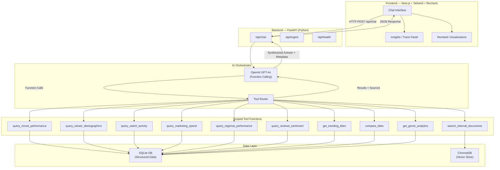

# Secure AI Insights Assistant

A secure, multi-source AI analytics assistant built for an entertainment company. This system answers business questions by combining structured relational data, unstructured internal documents, and external files, providing fully explainable insights with clear data lineage.

## 🚀 Key Features

* **Multi-Source Data Architecture**: Integrates SQLite (for structured, relational analytics) and ChromaDB (for semantic document search).
* **AI Orchestrator with Function Calling**: Uses OpenAI's `gpt-4o` to dynamically route queries to 10 strict, parameterized backend tools.
* **Explainability & Traceability**: The UI features an "Execution Trace" panel showing exactly which databases, tools, and arguments were used to generate the answer.
* **Secure Tool-Based Access**: The LLM *never* executes raw SQL or has direct database access. It can only call predefined, safe python functions.
* **Dynamic Data Visualization**: Automatically detects tabular analytics responses and renders beautiful `Recharts` visualizations.
* **Modern "Glassmorphism" UI**: Built with Next.js, TailwindCSS, and Lucide React.

---

## 🏗️ Architecture



---

## 🛠️ Tech Stack

| Layer | Technology |
|---|---|
| **Frontend** | Next.js 15, React 19, TailwindCSS, Recharts |
| **Backend** | Python 3.12, FastAPI, Uvicorn, Pydantic |
| **Databases** | SQLite (Structured), ChromaDB (Unstructured/Vector) |
| **AI / Orchestration**| OpenAI Python SDK (`gpt-4o`), Strict Function Calling |

---

## 🚀 Quick Start (Docker)

The easiest way to run the application is using Docker Compose.

1. Configure your environment variables in `backend/.env`:
   ```env
   OPENAI_API_KEY=sk-your-openai-api-key
   OPENAI_MODEL=gpt-4o
   API_KEY=dev-api-key-change-me
   ```

2. Build and start the containers:
   ```bash
   docker-compose up --build
   ```

3. Access the application:
   * **Frontend Interface**: `http://localhost:3000`
   * **Backend API Documentation**: `http://localhost:8000/docs`

> **Note**: On the very first startup, the backend will automatically generate all mock CSV data, mock markdown documents, build the SQLite database, and embed the documents into ChromaDB. This process takes a few moments.

---

## 💻 Local Development Setup

If you prefer to run the application directly on your host machine:

### Backend Setup

```bash
cd backend

# Create and activate a virtual environment
python -m venv venv
# Windows:
venv\Scripts\activate
# Unix/MacOS:
source venv/bin/activate

# Install dependencies
pip install -r requirements.txt

# Copy .env example and add your OpenAI Key
cp .env.example .env

# Generate mock data (CSVs and Markdown documents)
python scripts/generate_mock_data.py

# Ingest data into SQLite and ChromaDB
python scripts/ingest_data.py

# Start the FastAPI server
python -m uvicorn app.main:app --host 0.0.0.0 --port 8000
```

### Frontend Setup

```bash
cd frontend

# Install dependencies
npm install

# Start the Next.js development server
npm run dev
```

Navigate to `http://localhost:3000` to start chatting.

---

## 🧪 Required Example Questions to Try

The mock data has been specifically generated to answer the questions outlined in the assignment requirements. Try asking:

1. *"Which titles performed best in 2025?"* (Expects structured data table/chart)
2. *"Why is Stellar Run trending recently?"* (Expects combining SQL data with the Quarterly Report)
3. *"Compare Dark Orbit vs Last Kingdom."* (Expects a side-by-side comparison chart)
4. *"Which city had the strongest engagement last month?"* (Expects SQL aggregation)
5. *"What explains weak comedy performance?"* (Expects retrieval from the internal strategy document)
6. *"What recommendations would you give for leadership?"* (Synthesizes multiple sources)

---

## 🔐 Security & Data Handling

This project implements strict safety guidelines to fulfill the "Secure AI" requirement:

* **No Raw SQL Access**: The `gpt-4o` model is not given a schema or raw SQL capabilities. It can only execute predefined python functions defined in `app/tools/sql_tools.py`.
* **Parameter Validation**: All tool inputs are validated via Pydantic and passed as parameterized arguments to `sqlite3` to prevent SQL Injection.
* **Explainability via Metadata**: Every response sent to the frontend includes a `sources` array. This array details the exact `tool_name`, the `arguments` passed by the LLM, and the `execution_time_ms`. The frontend renders this in the right-hand panel.
* **API Key Auth**: The backend `/api/chat` and `/api/ingest` endpoints are protected by an `X-API-Key` header verified by a FastAPI middleware.
* **Rate Limiting**: In-memory rate limiting is applied via middleware to prevent abuse.

---

## 🤔 Assumptions & Trade-offs

1. **Mock Documents Format**: Instead of generating real PDF files programmatically (which requires complex dependencies like `ReportLab`), I generated Markdown (`.md`) files. The ingestion pipeline (chunking -> ChromaDB) works identically for text/markdown as it would for PDF extraction.
2. **OpenAI Direct SDK**: I chose to use the raw `openai` Python SDK instead of `LangChain` or `LlamaIndex`. Direct function calling provides a more predictable, transparent, and robust orchestration layer for this specific scope, avoiding the overhead and "magic" of larger frameworks.
3. **Database Choice**: SQLite was chosen per the assignment constraints ("for easy local setup and evaluation"). In a production scenario, this would be swapped for PostgreSQL.
4. **Authentication**: Given the assignment context, a static API key validation was implemented rather than a full OAuth2/JWT user management system.
5. **Session Management**: Conversation history is not currently persisted across browser refreshes for simplicity. The LLM maintains context within a single active thread using the frontend's state.
